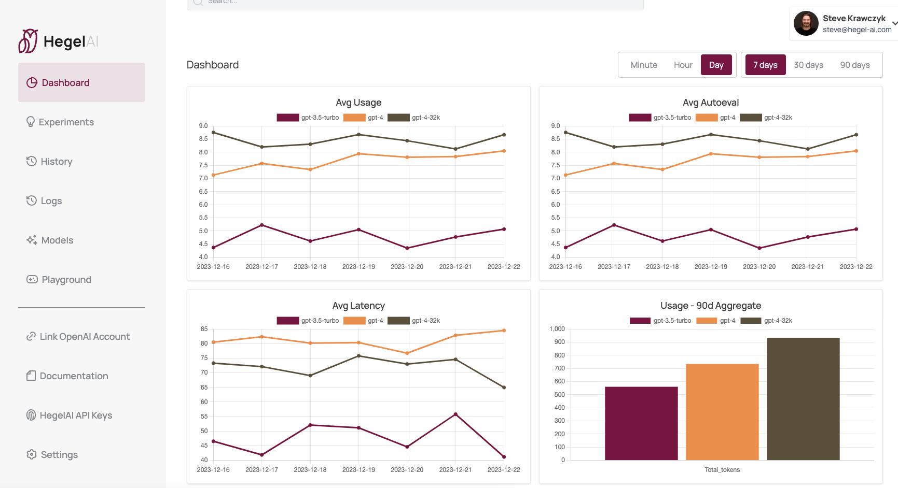
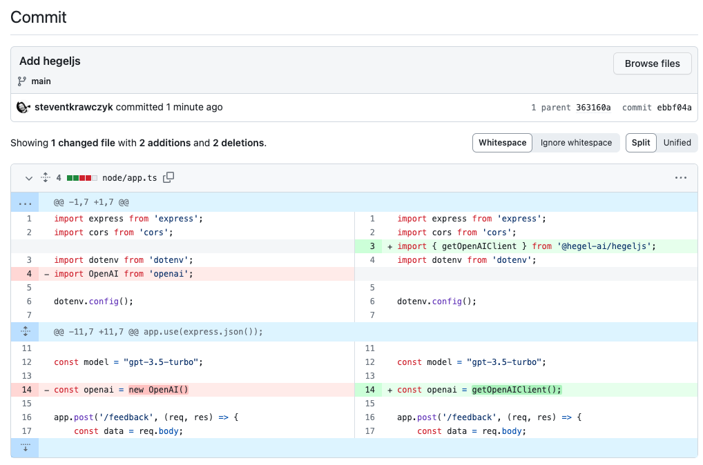

# hegeljs

Welcome to [HegelJS](https://www.npmjs.com/package/@hegel-ai/hegeljs)! The official TypeScript and JavaScript client for Hegel AI's developer platform.

[Hegel AI](https://hegel-ai.com) enables developers to build, monitor, and improve their LLM applications. It tracks every
request, provides and editor for prompts, and automatically generates improvements based on real-time feedback and evaluations. You can sign up [here](https://app.hegel-ai.com).

## Adding HegelJS to an existing Node.js app

Just install the package with `npm i @hegel-ai/hegeljs` and make the following change to your OpenAI client initialization:

To run the library, you'll need to have your `HEGELAI_API_KEY` set. If you need a Hegel AI API key, you can sign up [here](https://app.hegel-ai.com).
